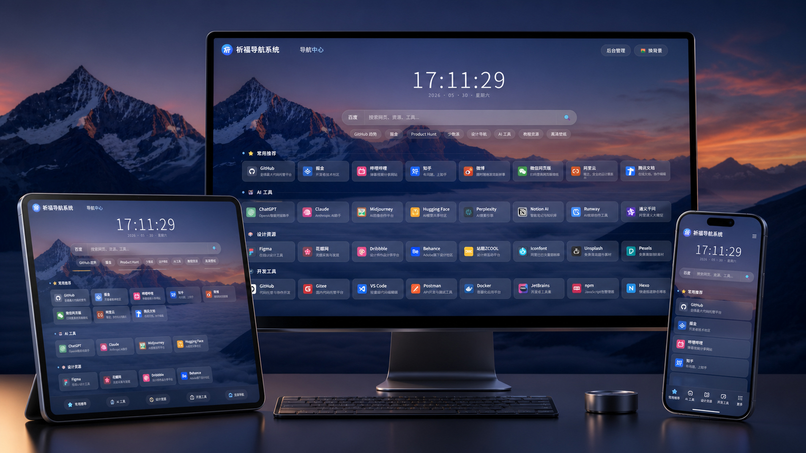
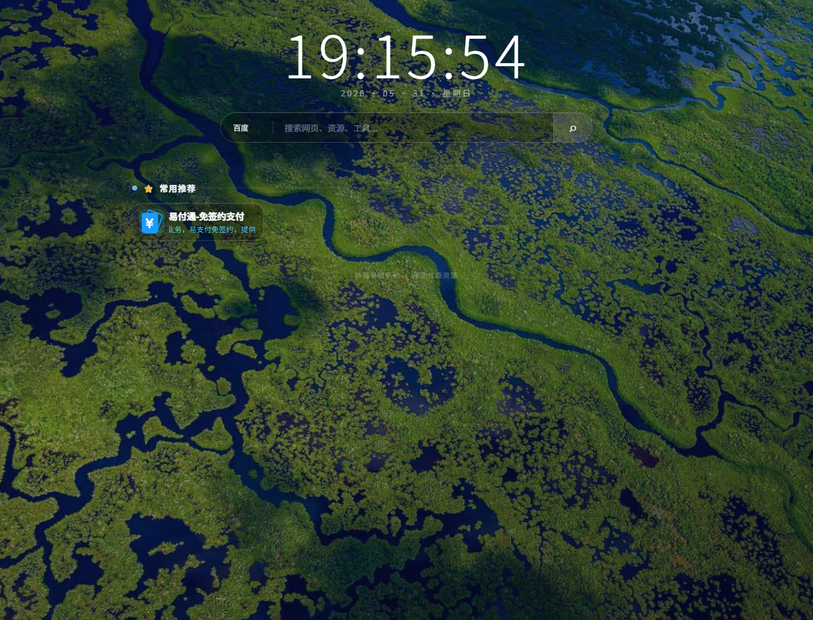

<div align="center">

# 祈福导航系统

**一套兼顾沉浸式前台体验与现代化后台管理的开源网址导航系统。**

[](https://github.com/JiangXinMao/qifudaohang/actions/workflows/ci.yml)
[](LICENSE)


[快速开始](#快速开始) · [核心能力](#核心能力) · [界面预览](#界面预览) · [运行要求](#运行要求) · [安全部署](#安全部署) · [许可证](#许可证)

</div>

## 项目定位

祈福导航系统面向个人主页、团队资源导航和公开网址目录。系统提供响应式沉浸式前台、站点与分类运营、友链审核、广告位管理、在线统计、备份与维护等能力，并配套基于 Vue 3 与 Art Design Pro 深度定制的管理后台。

正式部署不依赖 Composer，也不要求服务器安装 Node.js。仓库已经包含编译后的后台静态资源，上传 PHP 程序并完成安装向导即可运行；只有二次开发后台界面时才需要 Node.js 与 pnpm。

## 核心能力

- **沉浸式导航首页**：支持自定义背景、LOGO、搜索引擎、本站搜索、快捷标签和响应式 H5 布局。
- **站点内容运营**：管理站点、分类、排序和上下架状态，支持站点图标设置与网址图标获取。
- **分类视觉配置**：提供彩色图标选择，并允许管理员补充自定义图标。
- **友链申请与审核**：前台毛玻璃申请弹窗、提交反馈，以及后台审核和状态管理。
- **完整广告管理**：搜索栏下方四宫格广告位，以及 PC 左侧、右侧独立悬浮广告位。
- **在线统计组件**：支持真实匿名访客统计或按规则稳定生成的随机展示数据，并可选择暗色或高亮文字。
- **现代化管理后台**：统一菜单、表格、表单、通知、页面渐入动画和移动端适配。
- **维护与升级**：提供操作日志、备份、系统信息、在线更新检查和版本信息管理。
- **远程查询接口**：保留完整远程查询、签名校验和匿名功能调用上报代码，专属凭据通过本地配置或环境变量注入。
- **安全加固**：参数化查询、CSRF、登录限速、安全 Cookie、SSRF 防护、上传内容校验和后台目录改名支持。

## 界面预览

### 多终端导航体验



### 沉浸式首页



## 技术栈

| 层级 | 技术 |
| --- | --- |
| 服务端 | 原生 PHP 8.2+、PDO、Session |
| 数据库 | MySQL 5.6+、MySQL 5.7/8.0、MariaDB 10.x |
| 前台 | HTML5、原生 JavaScript、CSS |
| 管理后台 | Vue 3、TypeScript、Vite、Element Plus、Pinia、Art Design Pro |
| Web 服务 | Apache、Nginx；PHP 内置服务器仅用于本地测试 |

## 运行要求

- PHP `8.2` 或更高版本
- PHP 扩展：`PDO`、`PDO_MySQL`、`cURL`、`OpenSSL`、`fileinfo`
- MySQL `5.6+`、MySQL `5.7/8.0` 或 MariaDB `10.x`
- Apache 或 Nginx
- 安装阶段网站目录具备必要写权限
- 生产环境启用 HTTPS

## 快速开始

### 直接部署

```bash
git clone https://github.com/JiangXinMao/qifudaohang.git
```

1. 将仓库内容上传到独立的网站目录。
2. 创建 MySQL 或 MariaDB 数据库及独立数据库账号。
3. 浏览器访问站点 `/install/`，按向导完成环境检查、数据库连接和管理员初始化。
4. 安装完成后确认 `install/install.lock` 已生成。
5. 立即修改默认管理员密码，并将 `admin` 目录改为不易猜测的名称。

全新安装的默认账号与密码为 `admin1 / 123456`，仅用于完成首次登录，禁止继续用于生产环境。

### 本地评估

```bash
git clone https://github.com/JiangXinMao/qifudaohang.git
cd qifudaohang
php -S 127.0.0.1:8795 router.php
```

访问 `http://127.0.0.1:8795/`。仓库不会提交本机 `config.php`、SQLite 演示数据库或安装锁；首次运行请先使用安装向导生成配置。

### 后台前端开发

```bash
cd admin-ui-source
pnpm install --frozen-lockfile
pnpm run dev
pnpm run build
```

开发环境要求 Node.js `20.19+`、pnpm `8.8+`。生产服务器不需要安装这些工具。

## 远程更新与正式发布

公开源码包含完整的远程版本查询、匿名功能调用上报、Ed25519 签名验证、更新包下载和安全安装流程，但不包含官方查询端的专属凭据。

- 源码仓库使用 [includes/telemetry_credentials.example.php](includes/telemetry_credentials.example.php) 说明凭据格式。
- 本地或私有部署可通过 `includes/telemetry_credentials.php` 或环境变量注入凭据。
- `telemetry_credentials.php` 已加入 `.gitignore`，禁止提交到公共 Git 历史。
- 正式版凭据只在发布阶段注入经过验证的安装目录，然后将安装 ZIP 上传到 GitHub Releases。
- GitHub 自动生成的 Source code ZIP 不等同于正式安装包，也不会包含官方专属凭据。

远程清单和更新文件必须通过签名验证，客户端还会校验文件 SHA-256。版本查询入口位于 [includes/telemetry.php](includes/telemetry.php)，更新执行与用户数据保护逻辑位于 [includes/online_update.php](includes/online_update.php)。

## 目录结构

```text
qifudaohang/
├── admin/                  # PHP 后台入口与已编译管理后台资源
├── admin-ui-source/        # Vue 3 / TypeScript 管理后台源码
├── assets/                 # 前台第三方与公共资源
├── css/                    # 前台样式
├── images/                 # 默认图片与项目预览
├── includes/               # 数据访问、安全、统计和业务模块
├── install/                # Web 安装向导与数据库结构
├── js/                     # 前台交互脚本
├── tests/                  # PHP 回归测试
├── index.php               # 前台入口
├── router.php              # PHP 内置服务器路由
└── 安全部署说明.md          # 生产环境安全建议
```

## 安全设计

- 数据库访问统一使用参数化查询，降低 SQL 注入风险。
- 后台写操作要求登录态与 CSRF 校验。
- 登录失败达到阈值后按账号与来源 IP 临时锁定。
- 管理员密码使用 PHP 安全密码散列，并兼容旧密码首次登录迁移。
- 图片上传同时校验扩展名、MIME、真实图像内容和随机文件名。
- 外部访问默认屏蔽配置、备份、测试、SQLite、安装锁等运行文件。
- 后台目录可以改名，减少固定入口暴露。

安全问题请通过 GitHub 的私密安全报告功能提交，具体方式见 [SECURITY.md](SECURITY.md)。请勿在公开 Issue 中粘贴数据库、配置、账号、Cookie、日志原文或服务器地址。

## 安全部署

- 使用 HTTPS，并正确配置真实客户端 IP 与反向代理信任范围。
- 数据库使用独立账号和最小权限，不要开放公网数据库端口。
- 安装后收回不必要的写权限，并检查 `install/install.lock`。
- 重命名默认 `admin` 目录，不要保留默认目录副本。
- 定期创建离线备份，并在隔离环境验证恢复流程。
- 升级前同时备份数据库和完整程序目录，不要直接覆盖现有 `config.php`。

完整说明见 [安全部署说明.md](安全部署说明.md) 与 [安装文档.txt](安装文档.txt)。

## 验证

```bash
php tests/install_flow_test.php
php tests/admin_path_test.php
php tests/security_test.php

cd admin-ui-source
pnpm run build
```

GitHub Actions 会在每次推送时执行 PHP 语法检查、核心无数据库回归测试和管理后台生产构建。

## 第三方组件

管理后台基于 [Art Design Pro](https://github.com/Daymychen/art-design-pro) 定制，原项目依据 MIT License 发布，原始许可证保存在 [admin-ui-source/LICENSE](admin-ui-source/LICENSE)。Vue、Element Plus、Vite 及其他 npm 依赖继续适用各自许可证。

完整归属说明见 [THIRD_PARTY_NOTICES.md](THIRD_PARTY_NOTICES.md)。

## 许可证

祈福导航系统由 JiangXinMao（匠心猫）依据 [MIT License](LICENSE) 开源。你可以自由使用、复制、修改、合并、发布、分发、再授权或销售本软件，包括商业用途，但必须保留原版权与许可证声明。

第三方组件继续适用各自许可证。

---

<div align="center">

**Designed and maintained by JiangXinMao（匠心猫）**

Copyright 2026 JiangXinMao（匠心猫）

[项目主页](https://github.com/JiangXinMao/qifudaohang) · [问题反馈](https://github.com/JiangXinMao/qifudaohang/issues) · [官网（建设中）](https://www.jiangxinmao.com)

</div>
